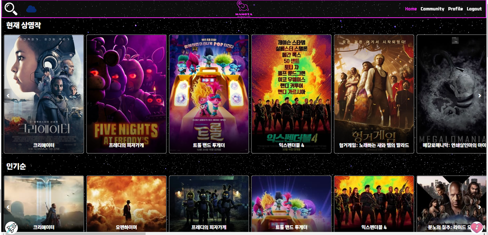
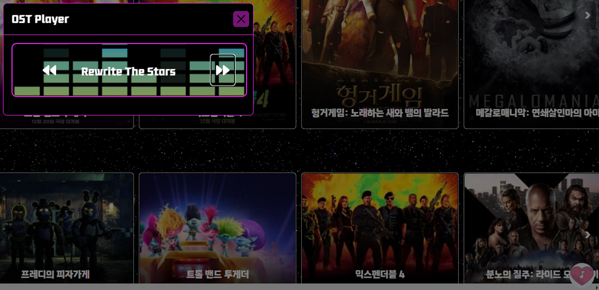

# 🚀My Movie Type (a.k.a. MaMoTa)🚀
삼성청년SW아카데미 1학기 관통 프로젝트 

## 목차
- [🚀My Movie Type (a.k.a. MaMoTa)🚀](#my-movie-type-aka-mamota)
  - [목차](#목차)
  - [1. 팀원 정보 및 업무 분담 내역](#1-팀원-정보-및-업무-분담-내역)
    - [인트로](#인트로)
    - [팀원](#팀원)
  - [2. 목표 서비스 구현 및 실제 구현 정도](#2-목표-서비스-구현-및-실제-구현-정도)
    - [목표](#목표)
  - [3. ERD](#3-erd)
    - [Component](#component)
- [더 추가할 것](#더-추가할-것)
  - [4. 영화 추천 알고리즘](#4-영화-추천-알고리즘)
      - [상영 중인 영화, 개봉 예정작, 인기순, 평점순, 장르별 영화를 우선적으로 소개하여 영화를 추천](#상영-중인-영화-개봉-예정작-인기순-평점순-장르별-영화를-우선적으로-소개하여-영화를-추천)
      - [OST Player로 추천 페이지에 대한 흥미를 유발](#ost-player로-추천-페이지에-대한-흥미를-유발)
  - [5. 주요 기능](#5-주요-기능)
    - [accounts](#accounts)
      - [**\[로그인 \& 로그아웃\]**](#로그인--로그아웃)
      - [**\[회원 가입\]**](#회원-가입)
      - [**\[프로필 페이지\]**](#프로필-페이지)
    - [🎞 movies](#-movies)
      - [**\[인기 영화\]**](#인기-영화)
      - [**\[추천 \& 검색\]**](#추천--검색)
      - [**\[리뷰 \& 댓글\]**](#리뷰--댓글)
  - [6. 배포 서버 URL (배포했을 경우)](#6-배포-서버-url-배포했을-경우)
  - [7. 기타 (느낀점, 후기 등)](#7-기타-느낀점-후기-등)

  
## 1. 팀원 정보 및 업무 분담 내역

### 인트로

무슨 영화를 볼 지 결정하지 못하고 스트리밍 사이트에 들어갔다가, 영화 고르다가 지쳐서 안 본 경험 있으신가요?

내가 어떤 타입의 영화를 좋아하는지 잘 모르겠는, 결정을 잘 못하는 사람들이여!

**MaMoTa**와 함께 영화를 찾으러 우주로 떠나보아요!😋

### 팀원

|  |  |  |
| :----------------------------------------------------------: | :----------------------------------------------------------: | :----------------------------------------------------------: |
|           [김선욱](https://github.com/Woogie-Gim)           |             [오기선](https://github.com/gisun55555)             |             [최성호](https://github.com/seonghoho)             |
|    영화 추천 알고리즘 FE 구현 ,   movies FE 구현,   movie 검색  구현 |  영화 리뷰 커뮤니티 FE&BE 구현      | profile FE&BE 구현,   movies FE&BE 구현,   데이터 수집 |

## 2. 목표 서비스 구현 및 실제 구현 정도

### 목표

오늘 날씨를 통해서 영화를 추천해주는 알고리즘 구현

명대사 관련 커뮤니티 구현하려했으나 우선순위 후순위로 밀려서 구현하지 못 하였음

커뮤니티 부분 스포일러 관련 토클을 통해 내용 보이기 유무 를 구현하는 것을 목표 했으나 시간 부족으로 하지 못 하였음

ost 재생을 통하여 사용자에게 영화 간접적으로 추천

커뮤니트 영화에 대한 리뷰를 작성 시 별점을 게시글에 색깔과 이모지 표정을 다르게 표현하도록 제작 목표

## 3. ERD

### Component

# 더 추가할 것

## 4. 영화 추천 알고리즘

#### 상영 중인 영화, 개봉 예정작, 인기순, 평점순, 장르별 영화를 우선적으로 소개하여 영화를 추천

#### OST Player로 추천 페이지에 대한 흥미를 유발

## 5. 주요 기능

### accounts

#### **[로그인 & 로그아웃]**

- 네비게이션 바의 아이콘 누르면 다이얼로그 실행
- 필수 입력 값이 누락되면 사용자에게 표시
- 비밀 번호를 텍스트로도 확인 가능
- 로그인 성공 시 메인페이지 이동
- 로그인 실패 시 alert 생성
 

#### **[회원 가입]**

- 회원 가입 유효성 검사 구현
  - 아이디 : 이메일
  - 닉네임 : 특수문자 불가
  - 비밀 번호 : 숫자와 영어를 포함한 6-15 글자
 

#### **[프로필 페이지]**

- 프로필 사진, 팔로우/팔로잉, 찜한 영화, 작성한 리뷰
- 본인의 프로필 페이지일 경우, **정보 수정** 가능 (사진 업로드, 비밀번호 변경)
  - 사진 업로드 : 2MB 이하로 제한
  - 비밀번호 변경 : 기존 비밀번호 일치 여부 확인, 새 비밀번호 일치 여부 확인
- 타인의 프로필 페이지일 경우, **팔로우** 가능
  - 이미 팔로우 되어있다면 언팔로우, 아니라면 팔로우 버튼이 보임
  - 숫자를 클릭하면 팔로우/팔로잉 리스트 출력
  - 리스트에서 유저 닉네임을 클릭하면 해당 유저의 프로필 페이지로 이동
 

### 🎞 movies

#### **[인기 영화]**

- 현재 TOP 20 인기 영화 정보 제공 (매일 새로 정보 갱신)
- 영화 카드를 누르면 해당 영화 상세 정보 다이얼로그 실행
- 영화 카드에 있는 하트 아이콘을 통해 영화 좋아요 기능 제공
-  영화 상세 정보 모달의 '리뷰 보러 가기' 버튼 누르면 해당 영화의 리뷰 리스트 페이지로 이동
 

#### **[추천 & 검색]**

- 검색 자동 완성 기능 제공
- 검색어가 포함된 영화 제목 리스트 제공
- 인생 영화 제목을 입력하면 유사한 영화 10개 추천
- 최신 트렌드에 따라 바뀌는 5가지의 카테고리로 영화 추천
 

#### **[리뷰 & 댓글]**

- 자동 완성 기능 제공
- 검색 전에는 모든 리뷰 리스트 제공
- 검색 후에는 검색한 영화의 리뷰 리스트만 제공
- 툴 바의 연필 모양 아이콘을 클릭하면 리뷰 작성 폼으로 이동
- 리뷰의 상세 정보 제공
- '작성자의 모든 리뷰 더보기' 버튼 누르면 작성자의 프로필 페이지로 이동
- '수정 & 삭제' 버튼은 작성자에게만 보임
- 하트 아이콘을 통해 리뷰 좋아요 기능 제공
- 댓글 폼 아래의 댓글 리스트가 자동으로 갱신

## 6. 배포 서버 URL (배포했을 경우)

## 7. 기타 (느낀점, 후기 등)

