# 🚀My Movie Type (a.k.a. MaMoTa)🚀
삼성청년SW아카데미 1학기 관통 프로젝트 

## 목차
- [🚀My Movie Type (a.k.a. MaMoTa)🚀](#my-movie-type-aka-mamota)
  - [목차](#목차)
  - [1. 팀원 정보 및 업무 분담 내역](#1-팀원-정보-및-업무-분담-내역)
    - [인트로](#인트로)
    - [팀원](#팀원)
  - [2. 목표 서비스 구현 및 실제 구현 정도](#2-목표-서비스-구현-및-실제-구현-정도)
    - [목표](#목표)
    - [실제 구현](#실제-구현)
  - [3. ERD](#3-erd)
    - [Component](#component)
- [더 추가할 것](#더-추가할-것)
  - [4. 영화 추천 알고리즘](#4-영화-추천-알고리즘)
    - [주제별 영화 추천](#주제별-영화-추천)
    - [**\[OST Player\]**](#ost-player)
  - [5. 주요 기능](#5-주요-기능)
    - [Movies](#movies)
      - [**\[영화 상세 정보\]**](#영화-상세-정보)
      - [**\[영화 검색 기능\]**](#영화-검색-기능)
      - [**\[영화 외부 검색\]**](#영화-외부-검색)
      - [**\[날씨 기반 영화 추천\]**](#날씨-기반-영화-추천)
    - [Accounts](#accounts)
      - [**\[로그인\]**](#로그인)
      - [**\[로그아웃\]**](#로그아웃)
      - [**\[회원 가입\]**](#회원-가입)
      - [**\[프로필 페이지\]**](#프로필-페이지)
    - [Community](#community)
      - [**\[커뮤니티 페이지\]**](#커뮤니티-페이지)
      - [**\[게시글 작성\]**](#게시글-작성)
      - [**\[게시글 상세 정보\]**](#게시글-상세-정보)
  - [6. 후기](#6-후기)
    - [김선욱](#김선욱)
    - [오기선](#오기선)
    - [최성호](#최성호)

  
## 1. 팀원 정보 및 업무 분담 내역

### 인트로

무슨 영화를 볼 지 결정하지 못하고 스트리밍 사이트에 들어갔다가, 영화 고르다가 지쳐서 안 본 경험 있으신가요?

내가 어떤 타입의 영화를 좋아하는지 잘 모르겠는, 결정을 잘 못하는 사람들이여! 🏳‍🌈

**MaMoTa**와 함께 영화를 찾으러 우주로 떠나보아요!😋

### 팀원

|  |  |  |
| :----------------------------------------------------------: | :----------------------------------------------------------: | :----------------------------------------------------------: |
|           [김선욱](https://github.com/Woogie-Gim)           |             [오기선](https://github.com/gisun55555)             |             [최성호](https://github.com/seonghoho)             |
|    영화 추천 알고리즘 FE 구현 ,   movies FE 구현,   movie 검색  구현,   리뷰 상세 페이지 FE, BE 구현 |  영화 리뷰 커뮤니티 FE&BE 구현      | profile FE&BE 구현,   movies FE&BE 구현,   데이터 수집 |

## 2. 목표 서비스 구현 및 실제 구현 정도

### 목표

오늘 날씨를 통한 영화를 추천 알고리즘 구현

명대사 관련 커뮤니티 구현 및 명대사 검색 기능

특정 영화에 대한 리뷰를 작성 했을 때 그 영화 정보를 바로 볼 수 있게 구현

리뷰 스포일러 관련 토클을 통해 내용 보이기 유무를 구현

ost 재생을 통하여 사용자에게 영화 간접적으로 추천

리뷰 게시글에서 평가한 별 점을 이모지를 통해 직관적인 표현을 구현

### 실제 구현

오늘 날씨를 통한 영화를 추천 알고리즘 구현 ✔

명대사 관련 커뮤니티 구현은 우선순위 중 후순위에 밀려 구현 하지 못함 ❌

특정 영화에 대한 리뷰를 작성 했을 때 그 영화 정보를 바로 볼 수 있게 구현 ✔

스포일러 토글 관련 기능은 시간 부족으로 인해 구현 하지 못함 ❌

Ost Player 구현하여 사용자에게 영화를 간접적으로 추천 ✔

리뷰 게시글에서 평가한 별 점을 이모지를 통해 직관적인 표현을 구현 ✔

## 3. ERD

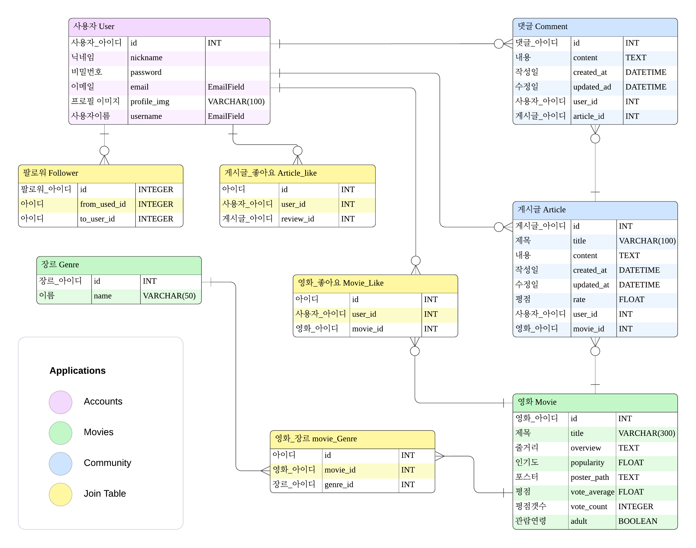

### Component

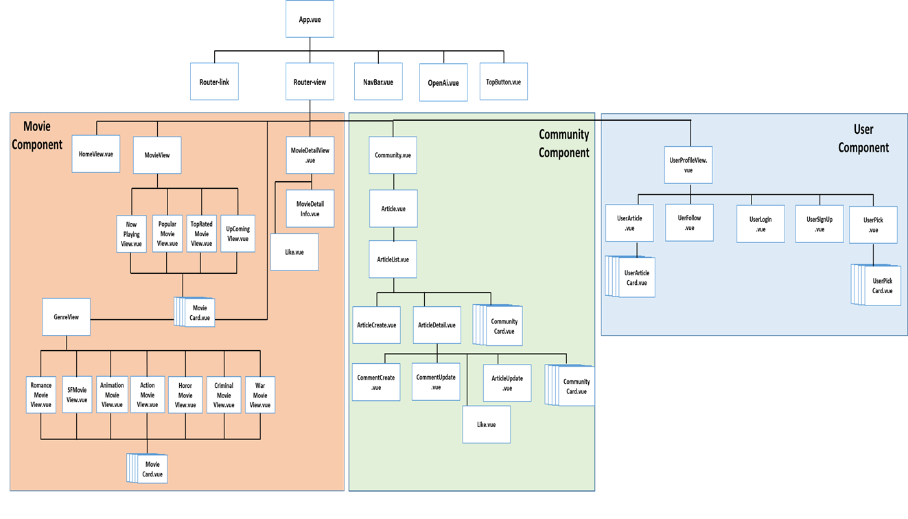

# 더 추가할 것

## 4. 영화 추천 알고리즘

### 주제별 영화 추천

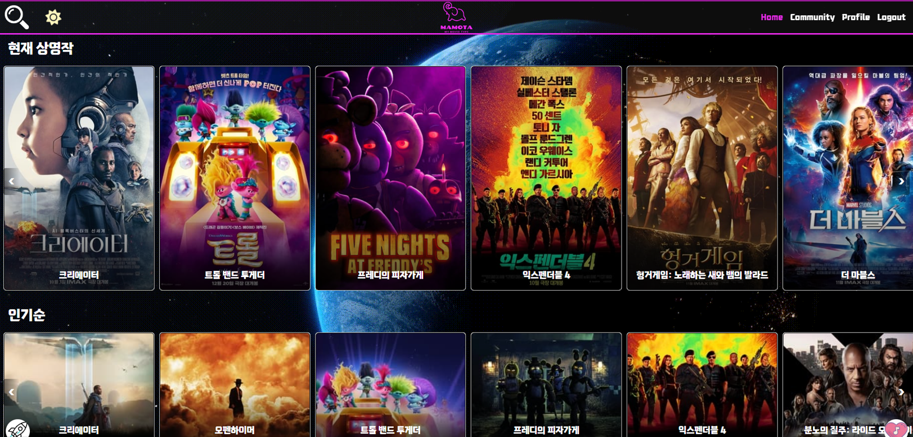
- 상영 중인 영화, 개봉 예정작, 인기순, 평점순, 장르별 영화를 우선적으로 소개하여 영화를 추천
- 현재 TOP 20 인기 영화 정보 제공 (매일 새로 정보 갱신)
- 영화 카드를 누르면 해당 영화 상세 정보 다이얼로그 실행
- 영화 모달에 있는 하트 아이콘을 통해 영화 좋아요 기능 제공

### **[OST Player]**

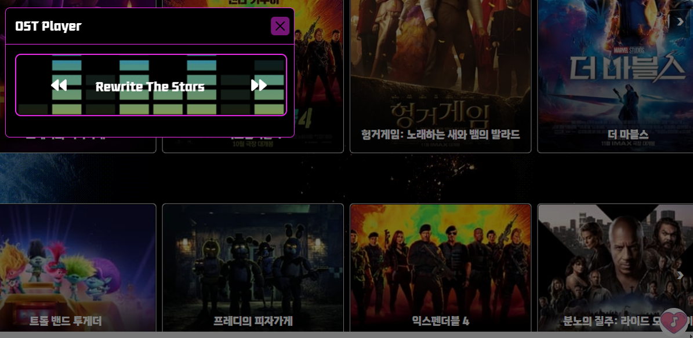

- OST Player로 추천 페이지에 대한 흥미를 유발

## 5. 주요 기능

### Movies

#### **[영화 상세 정보]**

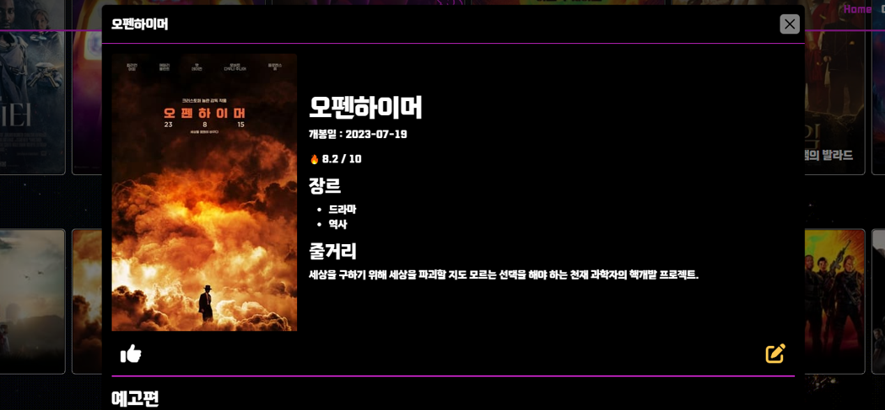

- 영화 ID를 통해 상세 페이지의 Router를 설정, 
- 모달을 통한 상세 페이지 구현
- 예고편, 감독, 배우 정보 소개
- 좋아요, 리뷰 작성 가능
 

#### **[영화 검색 기능]**

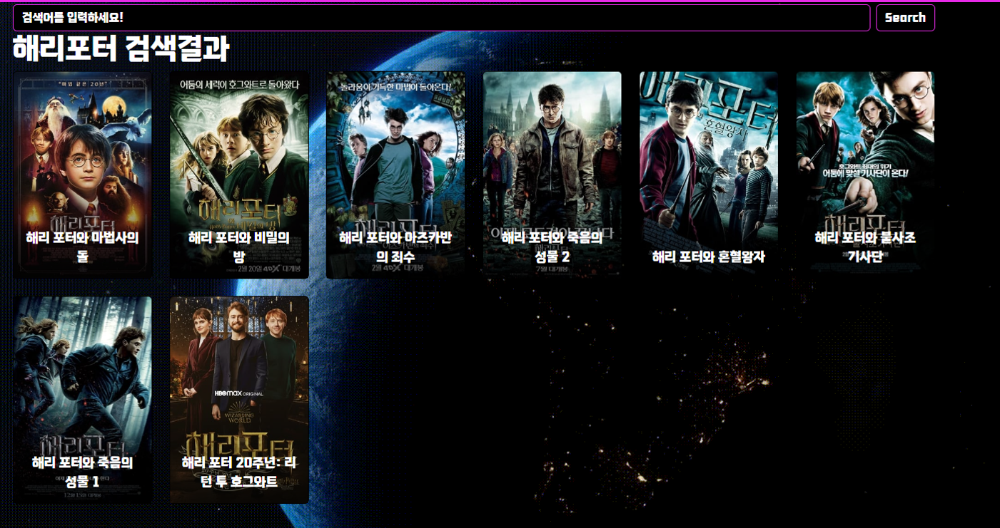

- 검색창에 영화 이름 검색하면 검색어를 포함한 영화 정보를 카드로 출력
- 영화 카드를 클릭하여 영화 Detail 페이지로 이동할 수 있도록 구현
 

#### **[영화 외부 검색]**

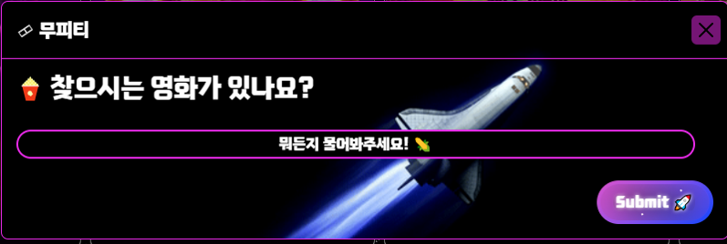

- 영화를 찾을 때 확실히 기억나지 않으면 영화에 대해 알려주기 위해 외부 검색 기능 도입
 

#### **[날씨 기반 영화 추천]**

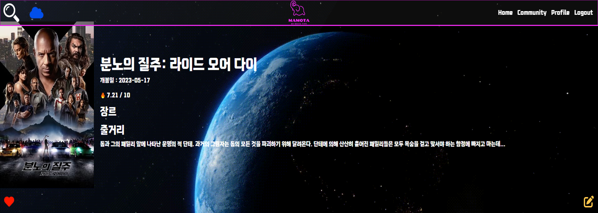

- 현재 날씨 정보를 API로 받아와 아이콘을 통해 알려주고, 날씨에 맞는 영화 추천  
 

### Accounts

#### **[로그인]**

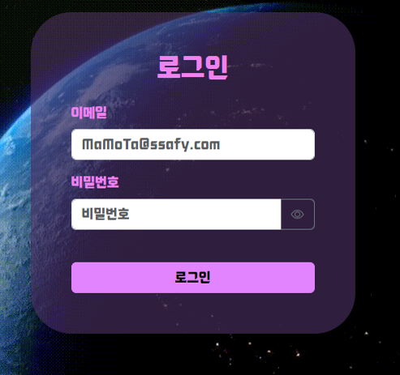
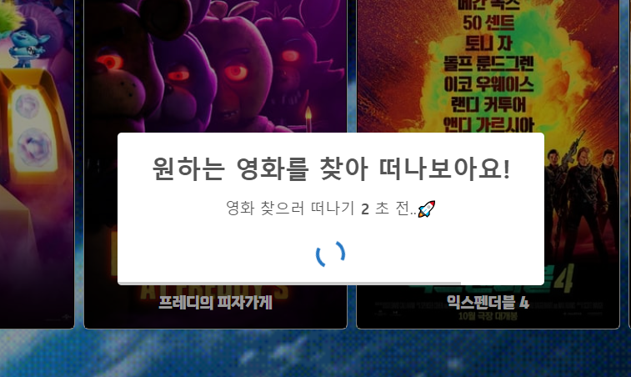

- 필수 입력 값이 누락되면 사용자에게 표시
- 비밀 번호를 텍스트로도 확인 가능
- 로그인 성공 시 3초간 알림창 생성 후 메인 페이지 이동
- 로그인 실패 시 alert 생성

#### **[로그아웃]**

 

#### **[회원 가입]**

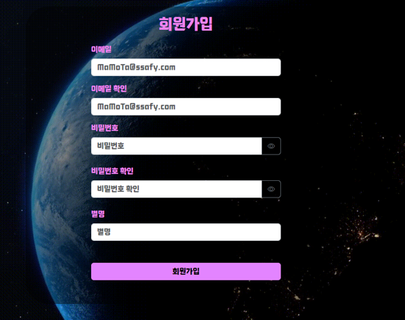

- 회원 가입 유효성 검사 구현
  - 아이디 : 이메일
  - 비밀번호 : 8자 이상
 

#### **[프로필 페이지]**

 
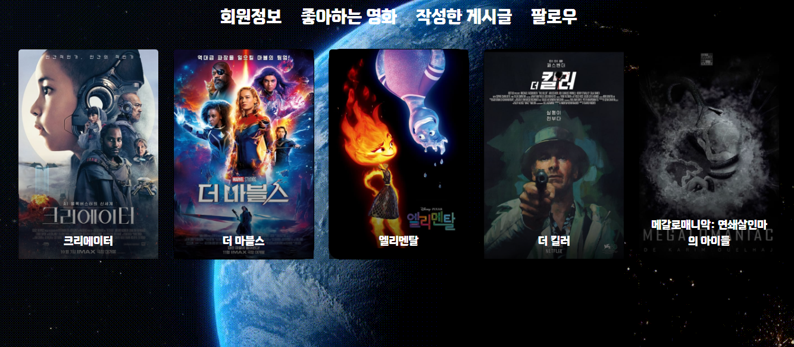 
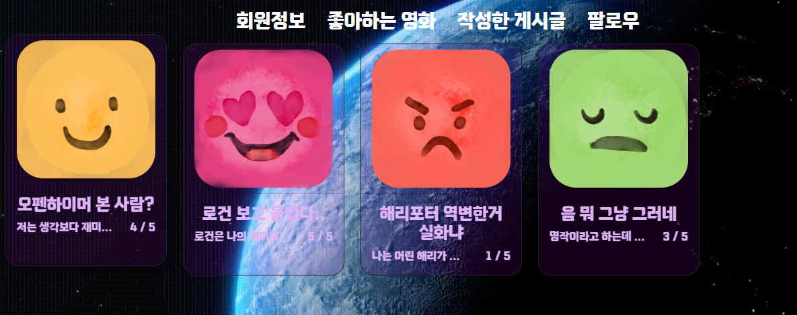 
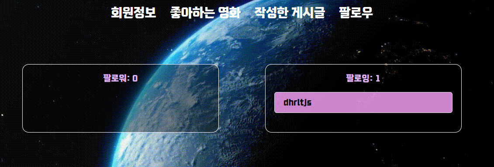 

- 회원 프로필, 좋아요 한 영화, 작성한 게시글, 팔로우/팔로잉 

- 타인의 프로필 페이지일 경우, 팔로우 가능
  - 이미 팔로우 되어있다면 언팔로우, 아니라면 팔로우 버튼이 보임
  - 숫자를 클릭하면 팔로우/팔로잉 리스트 출력
  - 리스트에서 유저 닉네임을 클릭하면 해당 유저의 프로필 페이지로 이동
 
 

### Community

#### **[커뮤니티 페이지]**

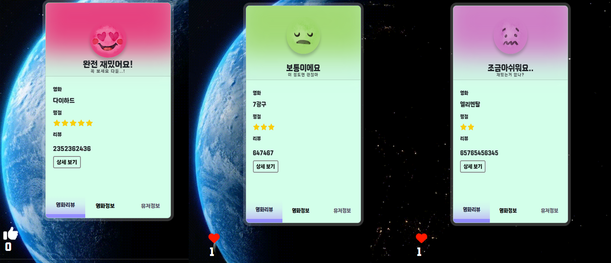

- 유저들이 작성한 다양한 리뷰에 대해 카드 형태로 표현
- 리뷰에 관련한 영화를 검색하여 정보 제공
- 작성 유저의 프로필 구경 가능
- 평점 별 다양한 표정 직관적으로 제공
- 평점을 별로 표현
 

#### **[게시글 작성]**

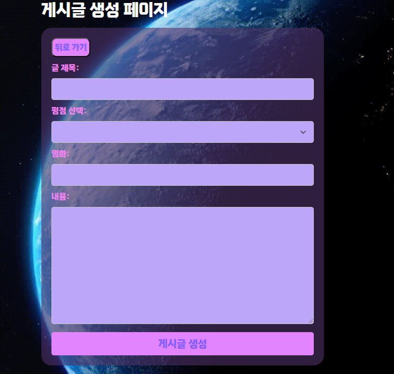

- 유저만의 특정 영화에 대한 정보 등을 제공하기 위한 리뷰 게시글 작성 가능

 

#### **[게시글 상세 정보]**

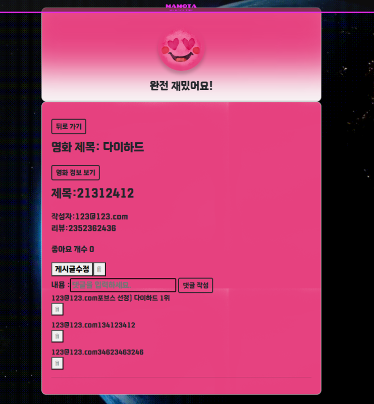

- 리뷰에 관한 상세 정보 출력
- 별점에 따른 이모지 출력으로 별점 시각화
- 게시글 수정 및 삭제 구현
- 댓글 작성, 수정, 삭제 구현

  

## 6. 후기

### 김선욱

첫 프로젝트를 진행하면서 계획 수립부터 모든 웹페이지 서비스를 구현하는 데까지 팀원들과 협업하여 완성해나가는 과정 속에서 Vue와 Django 다양한 프레임워크를 활용하는 방법들에 대해 응용해 나가며 익숙해질 수 있었고 팀원들과의 소통, GIT을 활용한 협업들에 대해 함께 배워나갈 수 있어서 좋은 경험이었습니다. 앞으로 프로젝트 및 현업에서도 지금 이 경험이 중요한 밑거름이 될 것 같습니다.

### 오기선

팀원들과 한 목표를 가지고 나아가는 경험을 해서 좋았고 ,프로젝트를 조금씩 하나 하나 만들어가면 될줄 알았는데 생각보다 비동기, 백과 프론트의 연동이 후반부로 갈수록 복잡하게 연결되어 있어 초기 목표 설정, 구상 및 설계에 중요성을 배웠습니다. 다음 기회에는 이부분에 신경을 더욱 써서 작성해야겠고, 첫 협업 경험이었는데 협업에 필요한 소통기술, git 사용을 어떤 흐름으로 진행되는지 배웠습니다.

### 최성호

백엔드 부분을 맡아서 작업을 진행했는데, Django를 배운 지 얼마 되지 않은 Vue와 백엔드와 프론트 엔드 프레임워크의 연결 관계에 대해 복습하는 기회가 되어 의미 있었고, 팀원들과 체계적인 역할 분담 후 진행해서 GIT 협업에서 문제 없이 진행해서 만족스럽습니다. 앞으로 프로젝트 진행 및 협업 시 더욱 발전하도록 하겠습니다.

